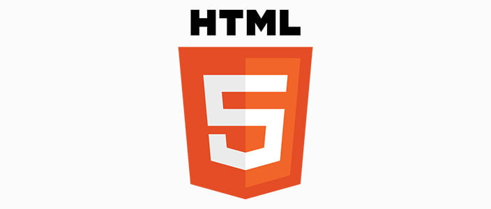
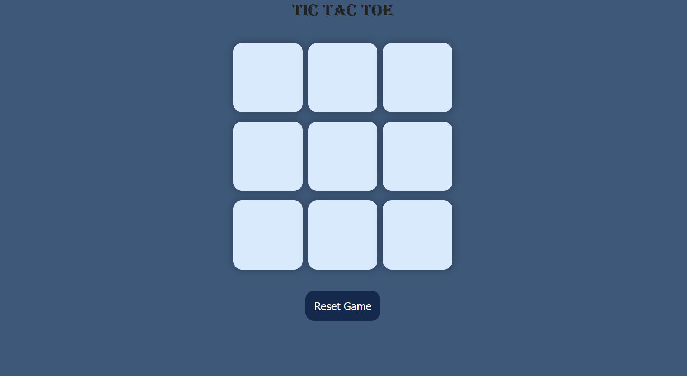
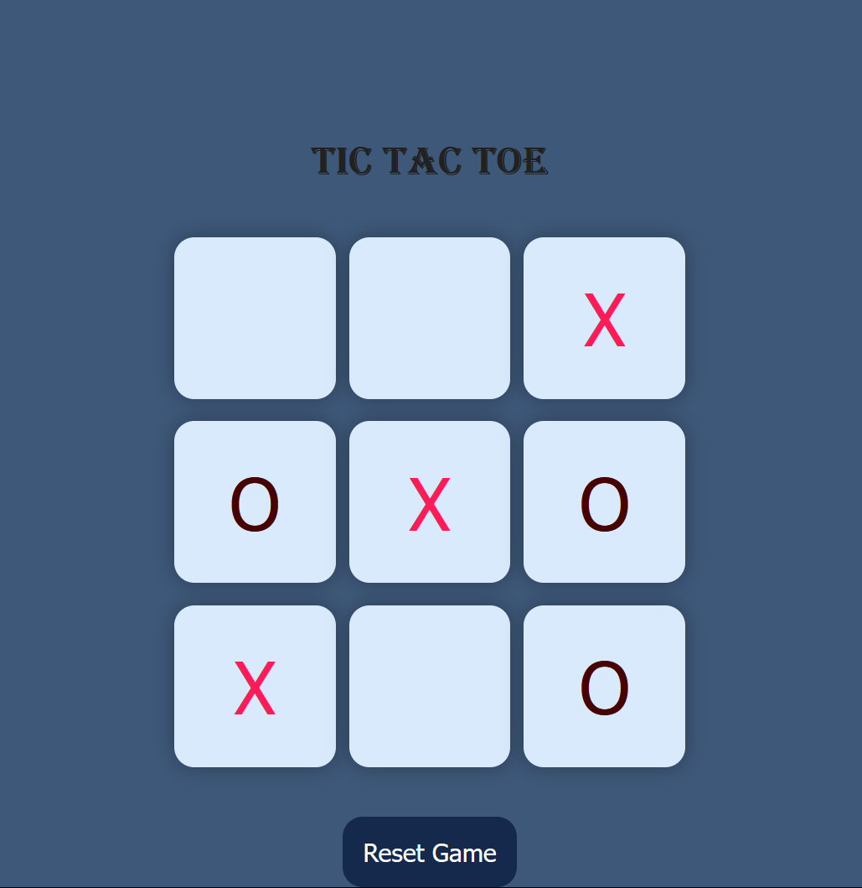
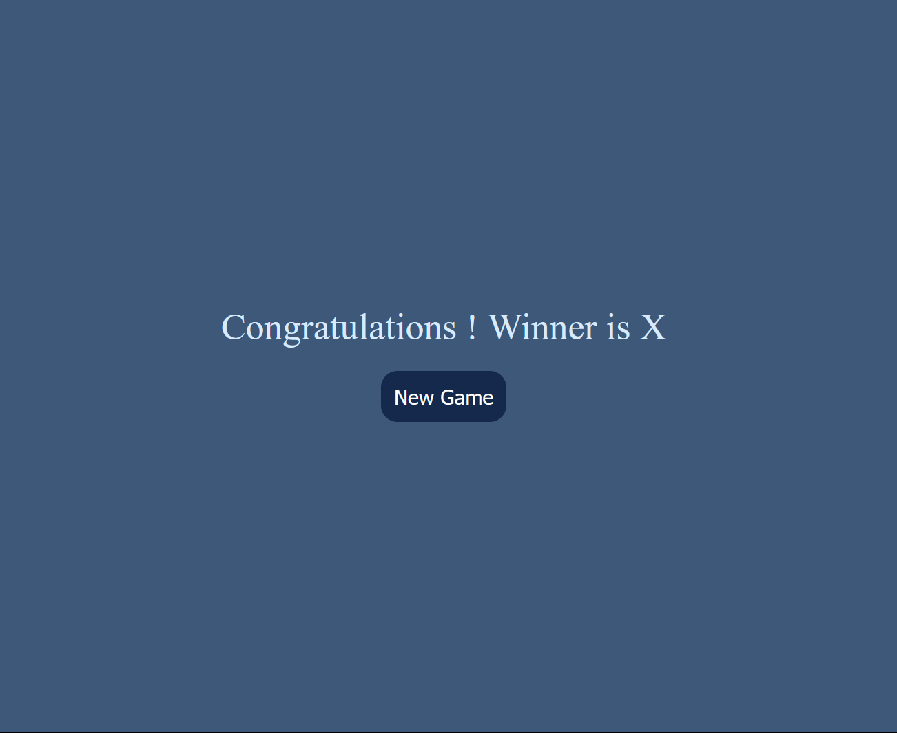

# Tic Tac Toe 🕹️🎮

A fun and interactive **Tic Tac Toe** game developed by using **HTML**, **CSS**, **JavaScript**. This project showcases essential web development skills with dynamic inetractivity , clean design, and user-friendly gameplay.

---

## Project Overview

**Purpose 🎯**: To showcase web-development skills like UI design, game logic implementation, and responsive design.

**Technologies Used 💻**:
- **HTML**: Structure of the game.
- **CSS**: Styling and responsiveness.
- **JavaSCript**: Game logic and inetractivity. ! [JS LOGO](Screenshots/JSlogo.png)

## Features 
- **Two-Player Gameplay**: Player 1 (X) and Player 2 (O) can play alternately on the same device.
- **Win and Draw Detection**: Automatically identifies and displays the winner or declares a draw.
- **Winning Highlight**: Highlights the winning combination on the grid for clarity.
- **Reset Functionality**: Allows players to restart the game; without refreshing the page.
- **Responsive Design**: Optimized for desktop and mobile devices for a seamless experience.
- **Screenshots**: Included to showcase the game in action.

---

## 📸 Screenshots 
### Game Start Screen: 


### Gameplay in Progress:


### Winner Announcement:


---

## 📜 How to Play
1. Clone the repository:
   ```bash
   git clone https://github.com/ShraddhaThakare801/Tic-Tac-Toe-Game.git

2. Navigate to the project folder and open index.html in your browser.
3. Player 1 (X) and Player 2 (O) take turns clicking on the cells to make their moves.
4. The game announces the winner or declares a draw at the end.
5. Use the reset button to restart the game.


